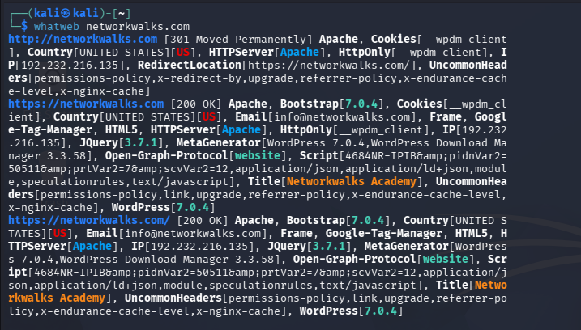
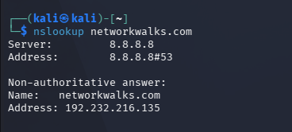
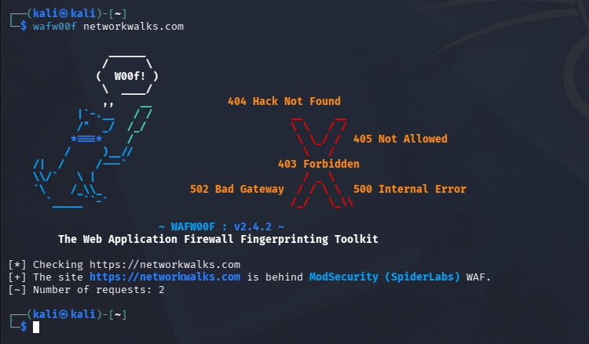
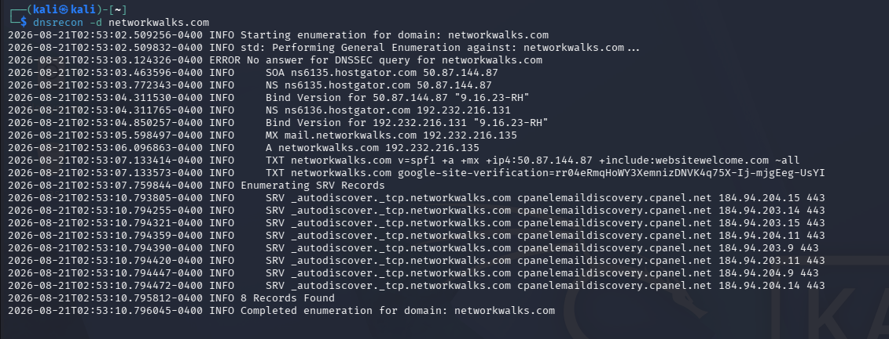
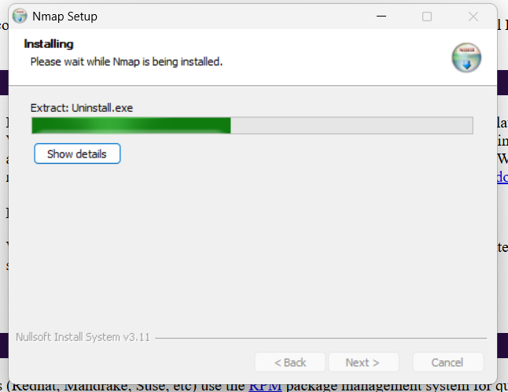
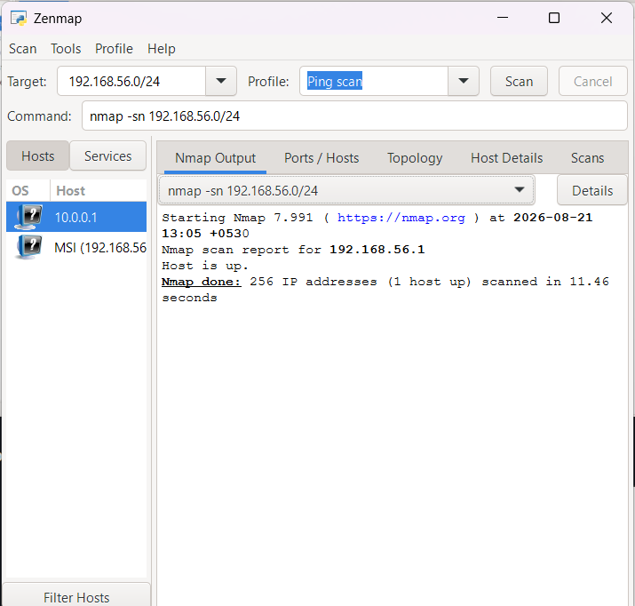
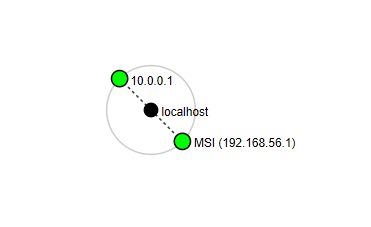

# Networkwalks-B082-week2--Cybersecurity-Footprinting-and-Network-Scanning
Performing Footprinting and Network scanning on isolated VM and on Authorised Company 
# 🛡️ Cybersecurity: Footprinting and Network Scanning

> **Program:** NetworkWalks Cyber Security Training & Internship  
> **Batch:** B082 — Week 2 | Project Module 1 (W2-PM1)  
> **Author:** Diksha Raul ([@Diksha0665](https://github.com/Diksha0665))  
> **Target:** `networkwalks.com`  

---

## Legal and Ethical Notice
All activities, commands, and tests documented in this report were conducted strictly in a controlled, sandboxed lab environment for authorized training purposes. Unauthorized network scanning, port probing, or vulnerability assessment against systems without written permission is strictly prohibited under applicable cyber laws


## Liability Disclaimer
This report is published strictly for educational and research purposes[cite: 1]. The author and affiliated institutions assume no liability or responsibility for any misuse, damage, or legal consequences resulting from the application of the tools and methodologies demonstrated.

##  Overview of Footprinting with 6 Tools
Reconnaissance (footprinting) is the first step in any attack or security assessment. An attacker collects public information about a target—such as domain ownership, IP address, hosting provider, running software, DNS records, and firewalls—without the target knowing it is being studied. 

This project covers passive and active reconnaissance against the target `networkwalks.com` using six Kali Linux tools.

---

##  Tools Used & Purpose

| Tool | Category | Purpose / Utility |
| :--- | :--- | :--- |
| **`whois`** | Passive Recon | Query public domain registration records, registrar details, and name servers. |
| **`whatweb`** | Technology Fingerprinting | Fingerprint web technologies: web server, CMS, plugins, frameworks, and IP address. |
| **`nslookup`** | DNS Resolution | Resolve the domain name to its direct IP address. |
| **`curl`** | Header Analysis | Read HTTP response headers to inspect server banners, cookies, and caching. |
| **`wafw00f`** | Firewall Detection | Detect whether a Web Application Firewall (WAF) is protecting the site. |
| **`dnsrecon`** | DNS Enumeration | Enumerate all DNS records (A, MX, SOA, TXT, SPF, and SRV records). |

---

##  Lab Execution & Findings

### Task 1: Domain Registration Details (whois)
* **Command:**
  ```bash
  whois networkwalks.com
  ```
  

* **Extracted Findings & Technical Analysis:**
 * **Registrar:** GoDaddy.com
 * **LLC  Creation Date:** 2019-11-06
 * **Registry Expiry Date:** 2027-11-06
 * **Name Servers:** NS6135.HOSTGATOR.COM, NS6136.HOSTGATOR.COM
 * **Hosting Infrastructure:** HostGator infrastructure confirmed via authoritative DNS delegations

### Task 2: Web Technology Fingerprinting (`whatweb`)
* **Objective:** Identify underlying web application architecture, CMS components, libraries, and hosting indicators.
* **Command:**
  ```bash
  whatweb example.com
  ```
 

 #### Findings:
 * **Target IP:** 192.232.216.135 
 * **Web Server:** Apache
 * **CMS & Plugins:** WordPress 7.0.4, WordPress Download Manager 3.3.58 
 * **Libraries & Frameworks:** Bootstrap 7.0.4, jQuery 3.7.1, HTML5 
 * **Email Contact:** info@networkwalks.com

### Task 3: DNS Name Resolution (nslookup)
* **Objective:** Resolve domain name to its direct IP address via DNS lookup.
* **Command:**
```bash
nslookup networkwalks.com
```



#### Findings:
* **DNS Server Queried:** 8.8.8.8#53 
* **Resolved IP Address:** 192.232.216.135  

### Task 4: HTTP Response Headers (curl)
* **Objective:** Read the HTTP response headers to see the server banner, status, cookies, and redirects. 
* **Command:**
```bash
curl -I [https://networkwalks.com](https://networkwalks.com)
```


#### Findings:
* **HTTP Status:** HTTP/2 200
* **Server:** Apache  
* **Caching Layer:** x-nginx-cache: WordPress, x-endurance-cache-level: 0  
* **REST API Discovered:** WordPress API endpoint exposed at /wp-json/ 
* **Cookie Flags: Set-Cookie:** __wpdm_client; HttpOnly; secure

### Task 5: Web Application Firewall Detection (wafw00f)
* **Objective:** Detect whether a Web Application Firewall (WAF) is protecting the target site. 
* **Command:**
```bash
wafw00f networkwalks.com
```




#### Findings:
* **WAF Status:** Detected 
* **Identified Firewall:** ModSecurity (SpiderLabs) WAF  

### Task 6: Comprehensive DNS Enumeration (dnsrecon)
* **Objective:** Enumerate all DNS records: name servers, mail servers, SPF, TXT, and service (SRV) records. 
* **Command:**
```bash
dnsrecon -d networkwalks.com
```



#### Findings:
* **A Record:** networkwalks.com -> 192.232.216.135 
* **MX Record:** mail.networkwalks.com -> 192.232.216.135  
* **BIND DNS Version:** 9.16.23-RH  SPF Record: v=spf1 a mx ip4:50.87.144.87 include:websitewelcome.com ~all  
* **SRV Records:** 8 cPanel email autodiscover records identified (cpanelemaildiscovery.cpanel.net)


## Comprehensive Target Profile Summary

| Intelligence Category | Profile Detail |
| :--- | :--- |
| **Domain & Host** | `networkwalks.com` / `192.232.216.135`[cite: 1] |
| **Registrar** | GoDaddy.com, LLC[cite: 1] |
| **Hosting Environment** | HostGator / cPanel Infrastructure[cite: 1] |
| **Web Server Daemon** | Apache with Nginx caching reverse-proxy[cite: 1] |
| **CMS Platform** | WordPress 7.0.4 with WP Download Manager 3.3.58[cite: 1] |
| **API Endpoints** | WordPress REST API active at `/wp-json/`[cite: 1] |
| **DNS Server Software** | BIND 9.16.23-RH[cite: 1] |
| **Perimeter Security** | ModSecurity (SpiderLabs) WAF active[cite: 1] |


## Defensive Hardening & Remediation Recommendations
Server Banner Masking: Disable the public server: Apache banner and hide caching headers (x-nginx-cache, x-endurance-cache-level) to prevent automated version enumeration.

REST API Restriction: Restrict unauthorized public access to /wp-json/ endpoints to mitigate user and plugin discovery.

DNS Version Suppression: Configure BIND configuration (named.conf) with version none; to suppress DNS engine version disclosure (9.16.23-RH).

WAF Rule Optimization: Regularly update ModSecurity OWASP Core Rule Sets (CRS) to prevent bypasses against active plugins.

## ⚖️ Legal and Ethical Notice
All activities were performed strictly under explicit written authorization and for educational purposes against authorized target lab infrastructure[cite: 1, 2]. Unauthorized access, probing, or scanning of computer networks without documented permission is illegal.
📄 **Authorization Document:** 
[View Permission Letter (PDF)](W2-PM-Sample%20Permission%20Letter%20v1.pdf)


## My PDF Report Writing Of footprinting
[View Footprinting Report](NetworkWalks_Week2_Reconnaissance_Lab_Report.pdf)


## Overview of PM5 — Network Scanning with Zenmap
The goal was to find the live devices on my own home network, along with their IP and MAC addresses, and save a network topology.

Zenmap is no longer available on modern Kali Linux (it depends on deprecated Python 2), so I installed the official Nmap + Zenmap package on Windows and scanned my own LAN from there.

Scan command:
```bash
nmap -sn 192.168.56.0/24
```
(a ping scan — finds live hosts, no port scanning)

#### * Result — 1 hosts live:

| IP | MAC | Device |
| :--- | :--- | :--- |
| `192.168.56.1` | `(Host interface)` | My laptop — MSI Thin 15 (from `ipconfig /all`) |

* #### Zenmap installed and running on Windows





Find the list of live hosts/PC’s in your IP subnet:

Open Zenmap, input the local LAN subnet & select Ping Scan to find the list of
live hosts in your subnet:


* ### Find the list of live hosts/PC’s in your IP subnet:

Open CMD & run ipconfig command to find your PC’s local IP address &
your local LAN subnet:


* ### Display & save the output topology in PDF Format on your desktop:



* ### My PDF Report on Zenmap
[View Zenmap Report](NetworkWalks_Week2_PM5_Zenmap_Scanning_Lab_Report.pdf)


